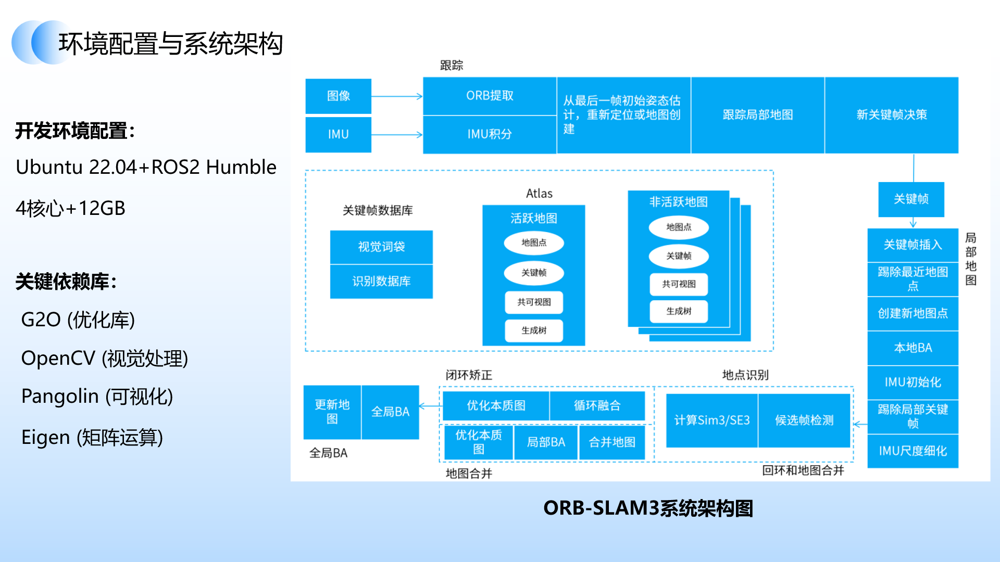
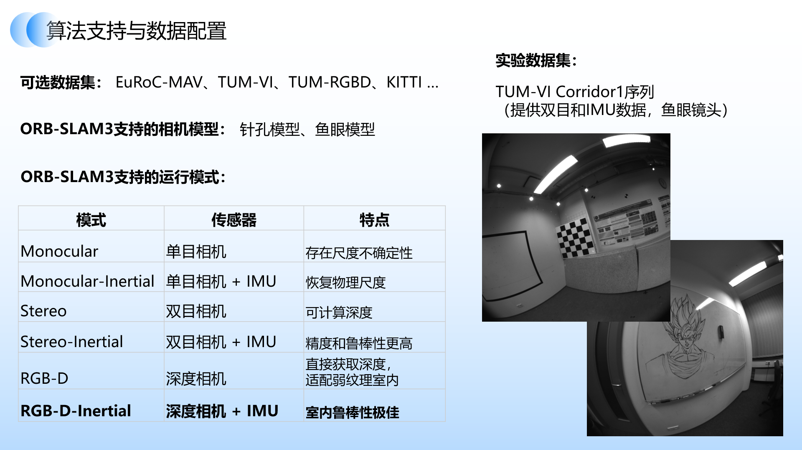
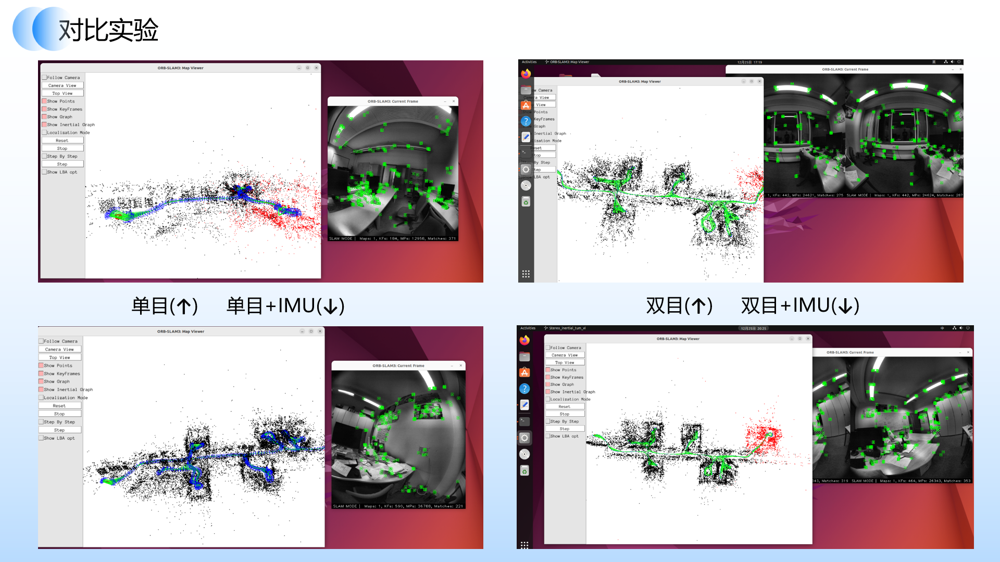
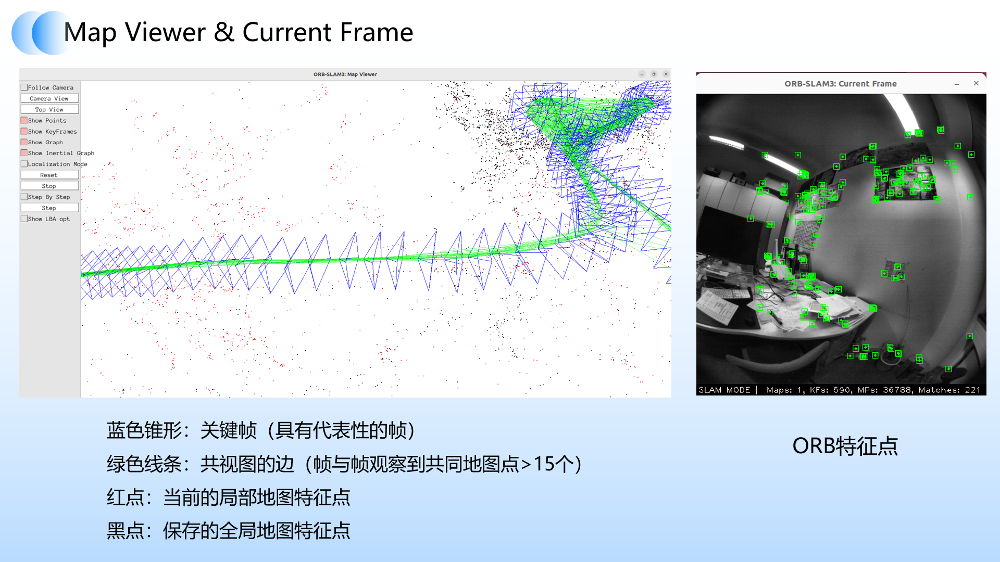
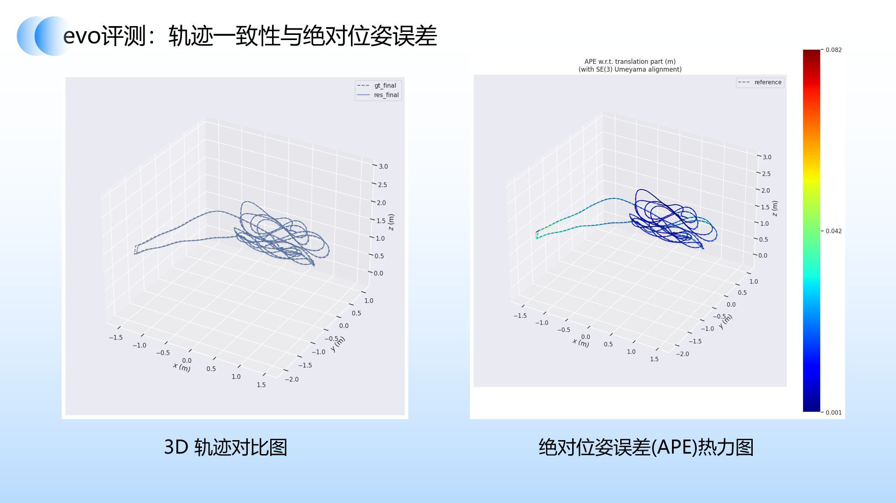
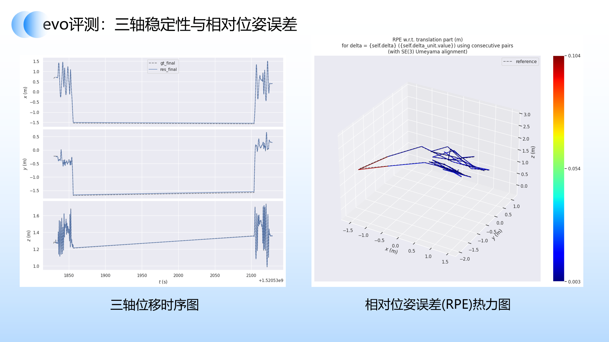
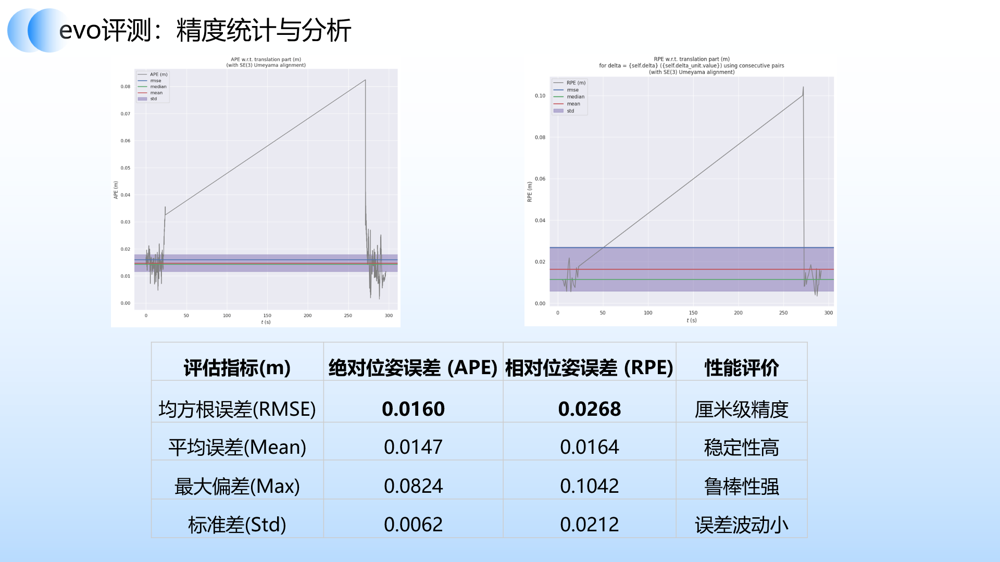

# ORB-SLAM3 Reproduce
本仓库在 Ubuntu22.04 上对 ORB-SLAM3 进行复现与评估。

> **NOTE**: This repository **should** have been forked from https://github.com/UZ-SLAMLab/ORB_SLAM3.

## 复现演示

以下视频为基于 **TUM-VI corridor1_512** 数据集，以 **双目+惯性（Stereo-Inertial）** 模式运行 ORB-SLAM3 的复现效果（8× 加速播放）：


https://github.com/user-attachments/assets/3296d284-6d7e-45f2-903b-c01f2d199c2d


## How to Start

**clone 本仓库后，按照以下步骤进行配置和运行**。

### 1. 环境配置
以下是经过验证的可用软硬件资源配置，可以参考此配置进行复现以避免编译期间的资源瓶颈。

**宿主机**：
* **OS:** Windows 11
* **CPU:** AMD R9-7940H
* **Hypervisor:** VMware Workstation 17.3 Pro

**虚拟机**：
* **OS:** Ubuntu 22.04 LTS
* **CPU:** 4 Cores
* **RAM:** 12 GB

下图为开发环境依赖库配置及 ORB-SLAM3 完整系统架构（Tracking → Local Mapping → Loop Closing → Atlas 多地图管理）：



### 2. 配置ORB-SLAM3
参考：[此博客](https://gist.github.com/bharath5673/4295e666cbe654a83226a2549a972c4f)

实际流程注意事项：
1. 需要提前更换软件源（推荐使用阿里云的源）
2. 第一阶段中需要补充安装软件包
3. 编译安装Opencv，设置并行编译参数为 `make -j4`
4. ORB-SLAM3的编译，虚拟机分配12GB的RAM + `make -j2`

### 3. 准备数据集，运行ORB-SLAM3

ORB-SLAM3 支持多种数据集与运行模式，下图列出了可选数据集、相机模型和传感器配置，本仓库主要使用 **TUM-VI Corridor1_512**（鱼眼双目+IMU）进行复现：



1. TUM-VI数据集  
   可以通过Linux bash下载。注意运行算法的时候需要修改源码来可视化，参考：[此博客](https://blog.csdn.net/2402_83452538/article/details/149153262?spm=1001.2014.3001.5502)
2. Euro数据集
   这个数据集的实际运行效果不佳，可能需要进一步修改源码。
3. 算法运行命令：  
   注意修改对应的路径。
    ```
    # 进入项目根目录
    cd ~/Dev/ORB_SLAM3

    # 确保程序有执行权限
    chmod +x ./Examples/Stereo/stereo_euroc

    # Euroc MH01_easy 数据集:
    # 运行双目（完整运行）
    ./Examples/Stereo/stereo_euroc \
        ./Vocabulary/ORBvoc.txt \
        ./Examples/Stereo/EuRoC.yaml \
        ~/Datasets/EuRoc/MH01 \
        ./Examples/Stereo/EuRoC_TimeStamps/MH01.txt \
        dataset-MH01_stereo
            
    # 运行单目（无画面）
    ./Examples/Monocular/mono_euroc \
        ./Vocabulary/ORBvoc.txt \
        ./Examples/Monocular/EuRoC.yaml \
        ~/Datasets/EuRoc/MH01 \
        ./Examples/Monocular/EuRoC_TimeStamps/MH01.txt \
        dataset-MH01_mono
        
    # 运行单目+惯性传感器（初始化失败、卡顿）
    ./Examples/Monocular-Inertial/mono_inertial_euroc \
        ./Vocabulary/ORBvoc.txt \
        ./Examples/Monocular-Inertial/EuRoC.yaml \
        ~/Datasets/EuRoc/MH01 \
        ./Examples/Monocular-Inertial/EuRoC_TimeStamps/MH01.txt \
        dataset-MH01_monoi
        
    # 运行双目+惯性传感器（无画面）
    # 赋予执行权限
    chmod +x ./Examples/Stereo-Inertial/stereo_inertial_euroc

    # 运行命令
    ./Examples/Stereo-Inertial/stereo_inertial_euroc \
        ./Vocabulary/ORBvoc.txt \
        ./Examples/Stereo-Inertial/EuRoC.yaml \
        ~/Datasets/EuRoc/MH01 \
        ./Examples/Stereo-Inertial/EuRoC_TimeStamps/MH01.txt \
        dataset-MH01_stereoi

    # TUM-VI数据集
    # 1. room1_512数据集
    # 单目：正常跑通
    chmod +x ./Examples/Monocular/mono_tum_vi

    ./Examples/Monocular/mono_tum_vi \
        ./Vocabulary/ORBvoc.txt \
        ./Examples/Monocular/TUM-VI.yaml \
        ~/Datasets/TUM_VI/dataset-room1_512_16/mav0/cam0/data \
        ./Examples/Monocular/TUM_TimeStamps/dataset-room1_512.txt \
        dataset-room1_512_mono

    # 2. corridor1_512数据集
    # 单目：正常跑通
    ./Examples/Monocular/mono_tum_vi \
    Vocabulary/ORBvoc.txt \
    Examples/Monocular/TUM-VI.yaml \
    ~/Datasets/TUM_VI/dataset-corridor1_512_16/mav0/cam0/data \
    Examples/Monocular/TUM_TimeStamps/dataset-corridor1_512.txt \
    dataset-corridor1_512_mono


    # 单目+惯性器：正常跑通
    ./Examples/Monocular-Inertial/mono_inertial_tum_vi \
        Vocabulary/ORBvoc.txt \
        Examples/Monocular-Inertial/TUM-VI.yaml \
        ~/Datasets/TUM_VI/dataset-corridor1_512_16/mav0/cam0/data \
        Examples/Monocular-Inertial/TUM_TimeStamps/dataset-corridor1_512.txt \
        Examples/Monocular-Inertial/TUM_IMU/dataset-corridor1_512.txt \
        dataset-corridor1_512_monoi
        
    # 双目+惯性：正常跑通
    ./Examples/Stereo-Inertial/stereo_inertial_tum_vi \
        ./Vocabulary/ORBvoc.txt \
        ./Examples/Stereo-Inertial/TUM-VI.yaml \
        ~/Datasets/TUM_VI/dataset-corridor1_512_16/mav0/cam0/data \
        ~/Datasets/TUM_VI/dataset-corridor1_512_16/mav0/cam1/data \
        ./Examples/Stereo-Inertial/TUM_TimeStamps/dataset-corridor1_512.txt \
        ./Examples/Stereo-Inertial/TUM_IMU/dataset-corridor1_512.txt \
        dataset-corridor1_512_stereoi
    ```

**四种运行模式对比截图（TUM-VI corridor1_512）：**

下图对比展示了单目、单目+IMU、双目、双目+IMU 四种模式在 corridor1_512 序列上的 Map Viewer 与 Current Frame 效果：



**Map Viewer 界面说明：**

下图为 Map Viewer 的详细界面及 Current Frame 的 ORB 特征点分布：



### 4. EVO评估
1. 安装evo测评工具，参考：[此博客](https://blog.csdn.net/qq_74338754/article/details/134407038)
2. 评估:  
(1) 主要评估了TUM-VI corridor1数据集的运行结果。  
参考：[此博客](https://zhuanlan.zhihu.com/p/607505986)，也是遇到了同样的问题。  
首先是安装缺失的包；  
需要关闭纳秒解析：  
    ```
    evo_config set euroc_use_nanoseconds false
    ```
    然后因为ORB-SLAM3 输出是 TUM 格式 (t, x, y, z, qx, qy, qz, qw)，TUM-VI data.csv 是 EuRoC 格式 (t, x, y, z, qw, qx, qy, qz)，编写脚本`./finalize_data.py`转化数据，转为秒、TUM格式：
    ```python
    import numpy as np

    def fix_gt():
        with open('corridor_gt_raw.csv', 'r') as f:
            lines = f.readlines()
        with open('gt_final.tum', 'w') as f:
            for line in lines:
                if line.startswith('#'): continue
                p = line.replace(',', ' ').split()
                if len(p) < 8: continue
                # 将纳秒转为秒，保留 9 位小数
                ts = float(p[0]) / 1e9
                f.write(f"{ts:.9f} {p[1]} {p[2]} {p[3]} {p[5]} {p[6]} {p[7]} {p[4]}\n")

    def fix_res():
        with open('f_dataset-corridor1_512_stereoi.txt', 'r') as f:
            lines = f.readlines()
        with open('res_final.tum', 'w') as f:
            for line in lines:
                p = line.split()
                if len(p) < 8: continue
                # 将纳秒转为秒，保留 9 位小数
                ts = float(p[0]) / 1e9
                f.write(f"{ts:.9f} {p[1]} {p[2]} {p[3]} {p[4]} {p[5]} {p[6]} {p[7]}\n")

    if __name__ == "__main__":
        fix_gt()
        fix_res()
        print("转换完成：时间戳已转为秒（TUM标准格式）")
    ```

    (2) 运行evo评估命令
    ```
    # 绘制轨迹
    evo_traj tum res_final.tum --ref=gt_final.tum -p --plot_mode xyz

    # 计算APE
    evo_ape tum gt_final.tum res_final.tum -va -p --align --t_max_diff 0.1

    # 保存轨迹png
    evo_traj tum res_final.tum --ref=gt_final.tum --align -p --save_plot ~/Datasets/Output/trajectory_comparison.png

    # 保存APE结果图像
    evo_ape tum gt_final.tum res_final.tum -va --align --t_max_diff 0.1 --save_plot ~/Datasets/Output/my_ape_result.png

    # 保存RPE结果图像
    evo_rpe tum gt_final.tum res_final.tum -va -p --align --t_max_diff 0.1 -d 1.0 -u m --save_plot ./rpe_result.png

    # 保存APE的评估数据到zip
    evo_ape tum gt_final.tum res_final.tum -va --align --t_max_diff 0.1 --save_results ~/Datasets/Output/stereo_inertial.zip

    # 评估 RPE 并保存结果到 zip
    evo_rpe tum gt_final.tum res_final.tum -va --align --t_max_diff 0.1 -d 1.0 -u m --save_results ~/Datasets/Output/stereo_inertial_rpe.zip
    ```

**评估结果可视化：**

3D 轨迹对比与 APE 绝对位姿误差热力图（估计轨迹与真值高度重合，误差集中在厘米级）：



三轴位移时序与 RPE 相对位姿误差热力图（XYZ 各轴漂移极小，RPE 误差分布均匀）：



APE / RPE 误差曲线及精度统计汇总（APE RMSE = **0.0160 m**，RPE RMSE = **0.0268 m**，达到厘米级定位精度）：



---

## 原 README.md

> 以下是官方 README.md 的内容

### V1.0, December 22th, 2021
**Authors:** Carlos Campos, Richard Elvira, Juan J. Gómez Rodríguez, [José M. M. Montiel](http://webdiis.unizar.es/~josemari/), [Juan D. Tardos](http://webdiis.unizar.es/~jdtardos/).

The [Changelog](https://github.com/UZ-SLAMLab/ORB_SLAM3/blob/master/Changelog.md) describes the features of each version.

ORB-SLAM3 is the first real-time SLAM library able to perform **Visual, Visual-Inertial and Multi-Map SLAM** with **monocular, stereo and RGB-D** cameras, using **pin-hole and fisheye** lens models. In all sensor configurations, ORB-SLAM3 is as robust as the best systems available in the literature, and significantly more accurate. 

We provide examples to run ORB-SLAM3 in the [EuRoC dataset](http://projects.asl.ethz.ch/datasets/doku.php?id=kmavvisualinertialdatasets) using stereo or monocular, with or without IMU, and in the [TUM-VI dataset](https://vision.in.tum.de/data/datasets/visual-inertial-dataset) using fisheye stereo or monocular, with or without IMU. Videos of some example executions can be found at [ORB-SLAM3 channel](https://www.youtube.com/channel/UCXVt-kXG6T95Z4tVaYlU80Q).

This software is based on [ORB-SLAM2](https://github.com/raulmur/ORB_SLAM2) developed by [Raul Mur-Artal](http://webdiis.unizar.es/~raulmur/), [Juan D. Tardos](http://webdiis.unizar.es/~jdtardos/), [J. M. M. Montiel](http://webdiis.unizar.es/~josemari/) and [Dorian Galvez-Lopez](http://doriangalvez.com/) ([DBoW2](https://github.com/dorian3d/DBoW2)).

<a href="https://youtu.be/HyLNq-98LRo" target="_blank"></a>

### Related Publications:

[ORB-SLAM3] Carlos Campos, Richard Elvira, Juan J. Gómez Rodríguez, José M. M. Montiel and Juan D. Tardós, **ORB-SLAM3: An Accurate Open-Source Library for Visual, Visual-Inertial and Multi-Map SLAM**, *IEEE Transactions on Robotics 37(6):1874-1890, Dec. 2021*. **[PDF](https://arxiv.org/abs/2007.11898)**.

[IMU-Initialization] Carlos Campos, J. M. M. Montiel and Juan D. Tardós, **Inertial-Only Optimization for Visual-Inertial Initialization**, *ICRA 2020*. **[PDF](https://arxiv.org/pdf/2003.05766.pdf)**

[ORBSLAM-Atlas] Richard Elvira, J. M. M. Montiel and Juan D. Tardós, **ORBSLAM-Atlas: a robust and accurate multi-map system**, *IROS 2019*. **[PDF](https://arxiv.org/pdf/1908.11585.pdf)**.

[ORBSLAM-VI] Raúl Mur-Artal, and Juan D. Tardós, **Visual-inertial monocular SLAM with map reuse**, IEEE Robotics and Automation Letters, vol. 2 no. 2, pp. 796-803, 2017. **[PDF](https://arxiv.org/pdf/1610.05949.pdf)**. 

[Stereo and RGB-D] Raúl Mur-Artal and Juan D. Tardós. **ORB-SLAM2: an Open-Source SLAM System for Monocular, Stereo and RGB-D Cameras**. *IEEE Transactions on Robotics,* vol. 33, no. 5, pp. 1255-1262, 2017. **[PDF](https://arxiv.org/pdf/1610.06475.pdf)**.

[Monocular] Raúl Mur-Artal, José M. M. Montiel and Juan D. Tardós. **ORB-SLAM: A Versatile and Accurate Monocular SLAM System**. *IEEE Transactions on Robotics,* vol. 31, no. 5, pp. 1147-1163, 2015. (**2015 IEEE Transactions on Robotics Best Paper Award**). **[PDF](https://arxiv.org/pdf/1502.00956.pdf)**.

[DBoW2 Place Recognition] Dorian Gálvez-López and Juan D. Tardós. **Bags of Binary Words for Fast Place Recognition in Image Sequences**. *IEEE Transactions on Robotics,* vol. 28, no. 5, pp. 1188-1197, 2012. **[PDF](http://doriangalvez.com/php/dl.php?dlp=GalvezTRO12.pdf)**

### 1. License

ORB-SLAM3 is released under [GPLv3 license](https://github.com/UZ-SLAMLab/ORB_SLAM3/LICENSE). For a list of all code/library dependencies (and associated licenses), please see [Dependencies.md](https://github.com/UZ-SLAMLab/ORB_SLAM3/blob/master/Dependencies.md).

For a closed-source version of ORB-SLAM3 for commercial purposes, please contact the authors: orbslam (at) unizar (dot) es.

If you use ORB-SLAM3 in an academic work, please cite:
  
    @article{ORBSLAM3_TRO,
      title={{ORB-SLAM3}: An Accurate Open-Source Library for Visual, Visual-Inertial 
               and Multi-Map {SLAM}},
      author={Campos, Carlos AND Elvira, Richard AND G\´omez, Juan J. AND Montiel, 
              Jos\'e M. M. AND Tard\'os, Juan D.},
      journal={IEEE Transactions on Robotics}, 
      volume={37},
      number={6},
      pages={1874-1890},
      year={2021}
     }

### 2. Prerequisites
We have tested the library in **Ubuntu 16.04** and **18.04**, but it should be easy to compile in other platforms. A powerful computer (e.g. i7) will ensure real-time performance and provide more stable and accurate results.

#### C++11 or C++0x Compiler
We use the new thread and chrono functionalities of C++11.

#### Pangolin
We use [Pangolin](https://github.com/stevenlovegrove/Pangolin) for visualization and user interface. Dowload and install instructions can be found at: https://github.com/stevenlovegrove/Pangolin.

#### OpenCV
We use [OpenCV](http://opencv.org) to manipulate images and features. Dowload and install instructions can be found at: http://opencv.org. **Required at leat 3.0. Tested with OpenCV 3.2.0 and 4.4.0**.

#### Eigen3
Required by g2o (see below). Download and install instructions can be found at: http://eigen.tuxfamily.org. **Required at least 3.1.0**.

#### DBoW2 and g2o (Included in Thirdparty folder)
We use modified versions of the [DBoW2](https://github.com/dorian3d/DBoW2) library to perform place recognition and [g2o](https://github.com/RainerKuemmerle/g2o) library to perform non-linear optimizations. Both modified libraries (which are BSD) are included in the *Thirdparty* folder.

#### Python
Required to calculate the alignment of the trajectory with the ground truth. **Required Numpy module**.

* (win) http://www.python.org/downloads/windows
* (deb) `sudo apt install libpython2.7-dev`
* (mac) preinstalled with osx

#### ROS (optional)

We provide some examples to process input of a monocular, monocular-inertial, stereo, stereo-inertial or RGB-D camera using ROS. Building these examples is optional. These have been tested with ROS Melodic under Ubuntu 18.04.

### 3. Building ORB-SLAM3 library and examples

Clone the repository:
```
git clone https://github.com/UZ-SLAMLab/ORB_SLAM3.git ORB_SLAM3
```

We provide a script `build.sh` to build the *Thirdparty* libraries and *ORB-SLAM3*. Please make sure you have installed all required dependencies (see section 2). Execute:
```
cd ORB_SLAM3
chmod +x build.sh
./build.sh
```

This will create **libORB_SLAM3.so**  at *lib* folder and the executables in *Examples* folder.

### 4. Running ORB-SLAM3 with your camera

Directory `Examples` contains several demo programs and calibration files to run ORB-SLAM3 in all sensor configurations with Intel Realsense cameras T265 and D435i. The steps needed to use your own camera are: 

1. Calibrate your camera following `Calibration_Tutorial.pdf` and write your calibration file `your_camera.yaml`

2. Modify one of the provided demos to suit your specific camera model, and build it

3. Connect the camera to your computer using USB3 or the appropriate interface

4. Run ORB-SLAM3. For example, for our D435i camera, we would execute:

```
./Examples/Stereo-Inertial/stereo_inertial_realsense_D435i Vocabulary/ORBvoc.txt ./Examples/Stereo-Inertial/RealSense_D435i.yaml
```

### 5. EuRoC Examples
[EuRoC dataset](http://projects.asl.ethz.ch/datasets/doku.php?id=kmavvisualinertialdatasets) was recorded with two pinhole cameras and an inertial sensor. We provide an example script to launch EuRoC sequences in all the sensor configurations.

1. Download a sequence (ASL format) from http://projects.asl.ethz.ch/datasets/doku.php?id=kmavvisualinertialdatasets

2. Open the script "euroc_examples.sh" in the root of the project. Change **pathDatasetEuroc** variable to point to the directory where the dataset has been uncompressed. 

3. Execute the following script to process all the sequences with all sensor configurations:
```
./euroc_examples
```

#### Evaluation
EuRoC provides ground truth for each sequence in the IMU body reference. As pure visual executions report trajectories centered in the left camera, we provide in the "evaluation" folder the transformation of the ground truth to the left camera reference. Visual-inertial trajectories use the ground truth from the dataset.

Execute the following script to process sequences and compute the RMS ATE:
```
./euroc_eval_examples
```

### 6. TUM-VI Examples
[TUM-VI dataset](https://vision.in.tum.de/data/datasets/visual-inertial-dataset) was recorded with two fisheye cameras and an inertial sensor.

1. Download a sequence from https://vision.in.tum.de/data/datasets/visual-inertial-dataset and uncompress it.

2. Open the script "tum_vi_examples.sh" in the root of the project. Change **pathDatasetTUM_VI** variable to point to the directory where the dataset has been uncompressed. 

3. Execute the following script to process all the sequences with all sensor configurations:
```
./tum_vi_examples
```

#### Evaluation
In TUM-VI ground truth is only available in the room where all sequences start and end. As a result the error measures the drift at the end of the sequence. 

Execute the following script to process sequences and compute the RMS ATE:
```
./tum_vi_eval_examples
```

### 7. ROS Examples

#### Building the nodes for mono, mono-inertial, stereo, stereo-inertial and RGB-D
Tested with ROS Melodic and ubuntu 18.04.

1. Add the path including *Examples/ROS/ORB_SLAM3* to the ROS_PACKAGE_PATH environment variable. Open .bashrc file:
  ```
  gedit ~/.bashrc
  ```
and add at the end the following line. Replace PATH by the folder where you cloned ORB_SLAM3:

  ```
  export ROS_PACKAGE_PATH=${ROS_PACKAGE_PATH}:PATH/ORB_SLAM3/Examples/ROS
  ```
  
2. Execute `build_ros.sh` script:

  ```
  chmod +x build_ros.sh
  ./build_ros.sh
  ```
  
#### Running Monocular Node
For a monocular input from topic `/camera/image_raw` run node ORB_SLAM3/Mono. You will need to provide the vocabulary file and a settings file. See the monocular examples above.

  ```
  rosrun ORB_SLAM3 Mono PATH_TO_VOCABULARY PATH_TO_SETTINGS_FILE
  ```

#### Running Monocular-Inertial Node
For a monocular input from topic `/camera/image_raw` and an inertial input from topic `/imu`, run node ORB_SLAM3/Mono_Inertial. Setting the optional third argument to true will apply CLAHE equalization to images (Mainly for TUM-VI dataset).

  ```
  rosrun ORB_SLAM3 Mono PATH_TO_VOCABULARY PATH_TO_SETTINGS_FILE [EQUALIZATION]	
  ```

#### Running Stereo Node
For a stereo input from topic `/camera/left/image_raw` and `/camera/right/image_raw` run node ORB_SLAM3/Stereo. You will need to provide the vocabulary file and a settings file. For Pinhole camera model, if you **provide rectification matrices** (see Examples/Stereo/EuRoC.yaml example), the node will recitify the images online, **otherwise images must be pre-rectified**. For FishEye camera model, rectification is not required since system works with original images:

  ```
  rosrun ORB_SLAM3 Stereo PATH_TO_VOCABULARY PATH_TO_SETTINGS_FILE ONLINE_RECTIFICATION
  ```

#### Running Stereo-Inertial Node
For a stereo input from topics `/camera/left/image_raw` and `/camera/right/image_raw`, and an inertial input from topic `/imu`, run node ORB_SLAM3/Stereo_Inertial. You will need to provide the vocabulary file and a settings file, including rectification matrices if required in a similar way to Stereo case:

  ```
  rosrun ORB_SLAM3 Stereo_Inertial PATH_TO_VOCABULARY PATH_TO_SETTINGS_FILE ONLINE_RECTIFICATION [EQUALIZATION]	
  ```
  
#### Running RGB_D Node
For an RGB-D input from topics `/camera/rgb/image_raw` and `/camera/depth_registered/image_raw`, run node ORB_SLAM3/RGBD. You will need to provide the vocabulary file and a settings file. See the RGB-D example above.

  ```
  rosrun ORB_SLAM3 RGBD PATH_TO_VOCABULARY PATH_TO_SETTINGS_FILE
  ```

**Running ROS example:** Download a rosbag (e.g. V1_02_medium.bag) from the EuRoC dataset (http://projects.asl.ethz.ch/datasets/doku.php?id=kmavvisualinertialdatasets). Open 3 tabs on the terminal and run the following command at each tab for a Stereo-Inertial configuration:
  ```
  roscore
  ```
  
  ```
  rosrun ORB_SLAM3 Stereo_Inertial Vocabulary/ORBvoc.txt Examples/Stereo-Inertial/EuRoC.yaml true
  ```
  
  ```
  rosbag play --pause V1_02_medium.bag /cam0/image_raw:=/camera/left/image_raw /cam1/image_raw:=/camera/right/image_raw /imu0:=/imu
  ```
  
Once ORB-SLAM3 has loaded the vocabulary, press space in the rosbag tab.

**Remark:** For rosbags from TUM-VI dataset, some play issue may appear due to chunk size. One possible solution is to rebag them with the default chunk size, for example:
  ```
  rosrun rosbag fastrebag.py dataset-room1_512_16.bag dataset-room1_512_16_small_chunks.bag
  ```

### 8. Running time analysis
A flag in `include\Config.h` activates time measurements. It is necessary to uncomment the line `#define REGISTER_TIMES` to obtain the time stats of one execution which is shown at the terminal and stored in a text file(`ExecTimeMean.txt`).

### 9. Calibration

You can find a tutorial for visual-inertial calibration and a detailed description of the contents of valid configuration files at  `Calibration_Tutorial.pdf`
